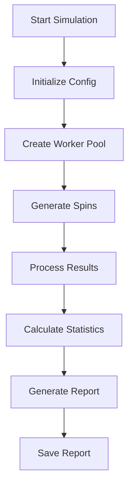
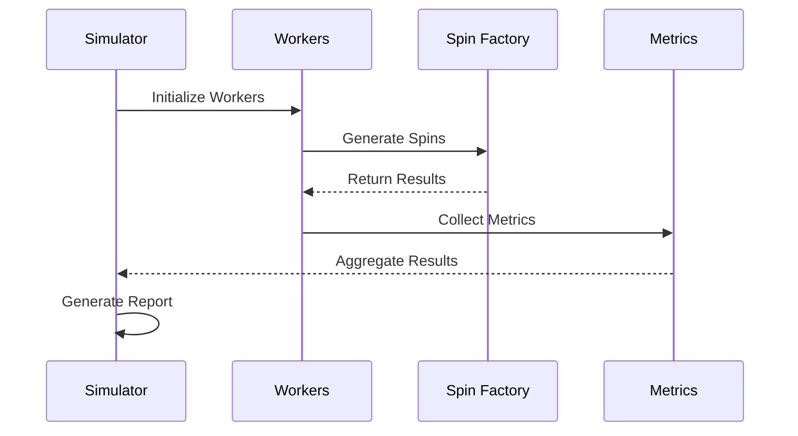
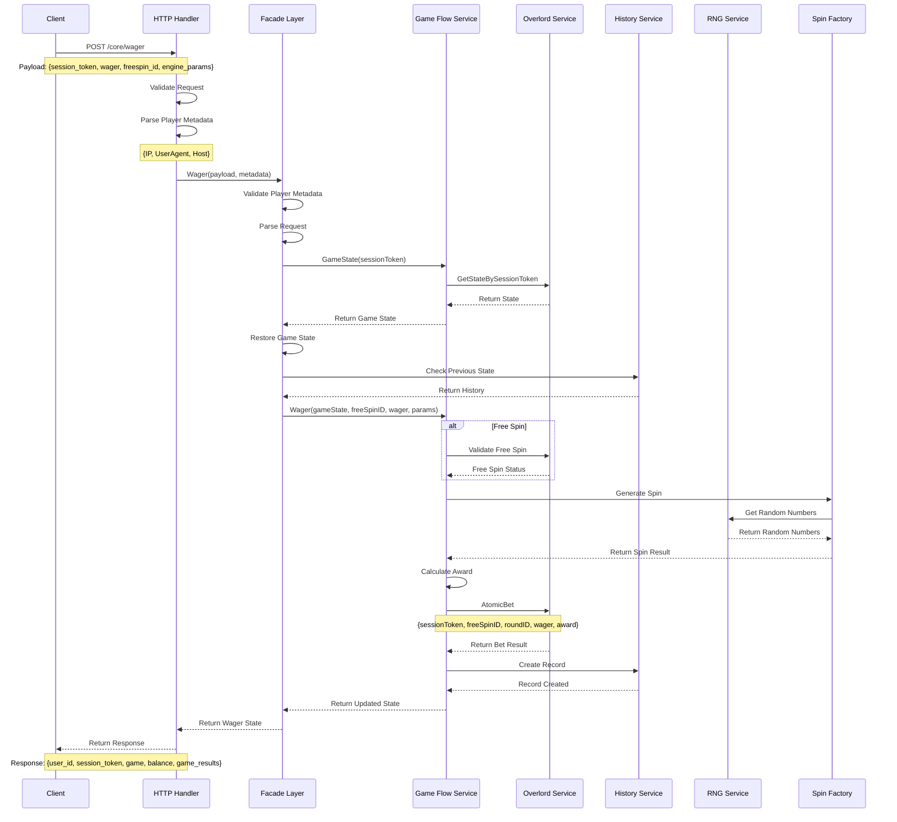

---
{"dg-publish":true,"permalink":"/system-analysis/simulation/simulation/","tags":["gardenEntry"]}
---

The simulation system is designed to:
1. Test game mechanics
2. Verify RTP (Return to Player)
3. Analyze volatility
4. Ensuring game fairness and reliability
5. Verifying mathematical models
6. Validate bonus features
	- Game volatility
	- Win distribution
	- Maximum win potential
	- Risk levels
7. Generate comprehensive reports
8. Collect detailed metrics
9. Discover Win patterns
10. Performance Testing
11. Balance Verification
	- Game balance
	- Win limits
	- Payout ratios
	- Feature frequencies

- [ ] Service Structure
- [ ] Configuration
- [ ] Simulation Flow
- [ ] Spin Generation
- [ ] Result Collection
- [ ] Simulation Process
- [ ] Metrics Collection
- [ ] Report Generation
- [ ] Parallel Processing
- [ ] Progress Tracking
- [ ] Statistics Calculation
- [ ] Output Reports

