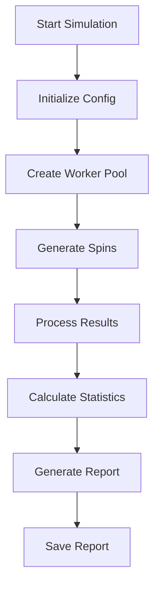

---
{"dg-publish":true,"permalink":"/system-analysis/simulation/simulation/","tags":["gardenEntry"]}
---

```mermaid
graph TD
    A[Start Simulation] --> B[Initialize Config]
    B --> C[Create Worker Pool]
    C --> D[Generate Spins]
    D --> E[Process Results]
    E --> F[Calculate Statistics]
    F --> G[Generate Report]
    G --> H[Save Report]
```
